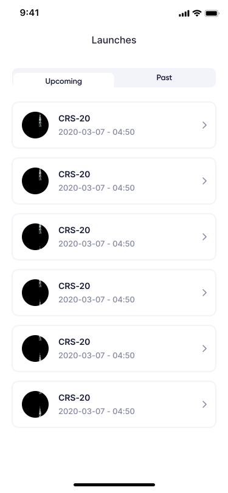
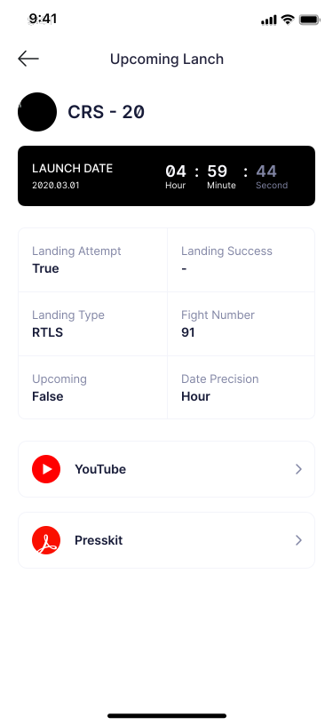
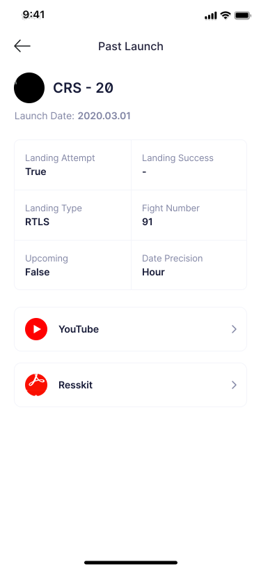

# iOS Challenge

### Intro
In this challenge you will make a SpaceX launch app. While you are following this challenge please make sure that you complete all the features and implement design pixel perfect.

### Submission
After completing the assignment, create a pull request to main branch. 
Then please send an email to the People & Culture Department with the link of the GitHub repo.

### Before you start
You must use SpaceX API. [API Doc Link](https://github.com/r-spacex/SpaceX-API/blob/master/docs/README.md)

For the design you should need to check the [Figma link](https://www.figma.com/file/zNAx35AaACFEVqxnqydje8/SpaceX-%5BCase%5D?node-id=0%3A1). You can find all design elements and the margin values on this link.

### Challenge
If you are all set, let's dive into the challenge. First you will find the general requirements of the app, after that challenge will go screen by screen. Each screen’s page there will be a design of the page, description of what we want in this screen as detailed as possible.

### General Requirements
- App should be coded with Swift Programming Language
- Feel free to use any architecture or design pattern. (MVVM is preferred)
- At least one 3rd party library should be implemented with CocoaPods.
- All screens should be pixel perfect design.
- You can build the user interface with XIBs, Storyboard or programmatically. (programmatically is preferred)
- App should be fully functional.
- Codable
- Network Layer

#### Main screen
This will be our first and main screen. On the top of the screen we want a segment which has upcoming and past tabs. Under the segment we need a list of launches. When user selects upcoming tab we need to show upcoming launches and when user selects past launches we need to show past launches. On the single launch element we need the launch name along with launch date and patch image.

##### Screen Features
- Pagination
- Pull to Refresh
- Loading & Error handles

| Required Api's| |
|--------|--------|
| https://api.spacexdata.com/v5/launches/past | Past |
| https://api.spacexdata.com/v5/launches/upcoming | Upcoming |
| https://api.spacexdata.com/v5/launches/query | Pagination |

#### Detail screen
This will be our second and last screen. On the top the screen we have a patch image of mission and name of the mission. We have a launch date component below the `navigationBar`. This component change depends on the launch time. If it is past we can directly show the launch date if it is upcoming we need to show count down to end-user. Launch detail table is located below the launch date component. On launch detail if information is null on the API you can simply use "-" on the section. If launch has youtube link or press kit link you can put them bottom of the screen.

##### Screen Features
- Loading & Error handles

|Required Api's|
|--------|
| https://api.spacexdata.com/v5/launches/{id} |

Upcoming | Past
------ | --------
 | 
